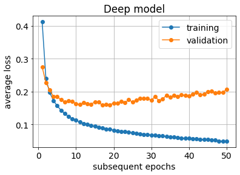
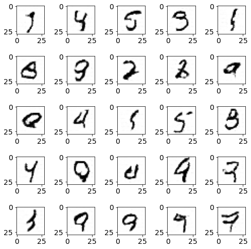

# deep-learning-workshops
notes for Deep Learning Workshops

## lecture notes:
- [machine learning fundamentals](ML_fundamentals.pdf)
- [convolutional neural networks and GANs](CNNs_and_GANs.pdf)

## laboratory classes
1. Handwritten digits classification using MNIST dataset with Pytorch
- models: perceptron, deep fully-connected network, generic CNN
- various activations,
- overfitting,
- early stopping

[Colab notebook](mnist_in_3_flavours.ipynb)

2. Convolutional GAN on MNIST
- generative adversarial network model: generator & discriminator 
- training GANs

[Colab notebook](GAN_on_MNIST.ipynb)

